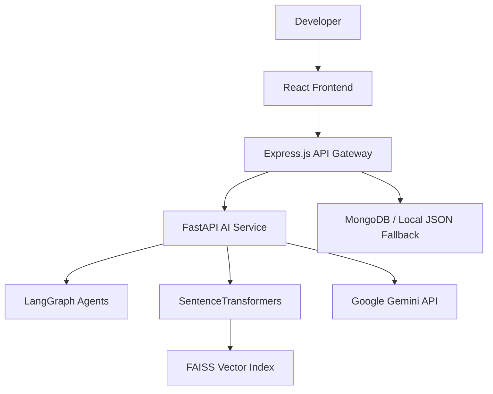

# Creation of Intelligent Bug Diagnosis Platform with Fix Recommendation Assistance
## AI Smart Bug Analyzer & Fix Advisor (BugSense AI)

BugSense AI is an intelligent software bug diagnosis and fix recommendation platform developed as a four-milestone project. The platform integrates Retrieval-Augmented Generation (RAG), semantic similarity retrieval, and multi-agent state machines to automate the ingestion, analysis, and triage of software defects. By parsing execution traces and matching anomalies against a local vector database, the platform provides developers with root-cause evaluations and fix recommendations.

---

## Table of Contents
1. Project Title
2. Project Overview
3. Problem Statement
4. Objectives
5. Key Features
6. System Architecture
7. Technology Stack
8. Milestone-wise Development
9. Complete End-to-End Workflow
10. Knowledge Base Growth Mechanism
11. Resolution Verification
12. Testing and Validation
13. Test Results
14. Project Documentation
15. Repository Structure
16. Installation / Setup
17. How to Run the Project
18. API / Service Overview
19. Future Enhancements
20. Individual Project
21. Acknowledgement

---

## 1. Project Title
* **Project Title:** Creation of Intelligent Bug Diagnosis Platform with Fix Recommendation Assistance
* **Project Name:** AI Smart Bug Analyzer & Fix Advisor (BugSense AI)
* **Project Type:** Four-Milestone AI-powered software bug diagnosis project.

---

## 2. Project Overview
BugSense AI is an intelligent software bug diagnosis and fix recommendation platform designed to assist developers in analyzing software defects, retrieving similar historical issues, detecting duplicate bugs, identifying severity and priority, analyzing logs, performing root-cause analysis, recommending fixes, verifying resolutions, and continuously growing the knowledge base.

The final system combines:
* Retrieval-Augmented Generation (RAG)
* Semantic similarity retrieval
* FAISS vector search
* Multi-agent diagnosis
* Deep log analysis
* Severity and priority prediction
* Module identification
* Resolution verification
* Knowledge base growth
* Defect pattern analytics

---

## 3. Problem Statement
Traditional software defect management workflows suffer from several key constraints:
* **Manual Anomaly Diagnosis:** Isolating calling sequences and exception sources in raw stack logs requires tedious line-by-line inspection.
* **Repeated Resolution Efforts:** Similar errors recur across environments without linking back to historical solutions, wasting developer hours on redundant troubleshooting.
* **Inference Complexity:** Associating log trace patterns with correct code-level root causes demands deep domain experience.
* **Disconnected Feedback Loop:** Validated resolution steps are rarely compiled back into indexable datastores to help automate future triage.

---

## 4. Objectives
* **Automate Bug Diagnosis:** Extract code anomaly structures and exceptions from trace records.
* **Retrieve Historical Context:** Leverage semantic search vector spaces to locate matching historical solutions.
* **Identify Ticket Properties:** Predict category modules, impact severity classes, and priority values.
* **Formulate Remediation Guidelines:** Recommend immediate code fixes and long-term prevention guidelines.
* **Update the Knowledge Base:** Integrate developer-verified resolutions into the vector search memory store.

---

## 5. Key Features
* **Multi-Format Bug Submission:** Ingest raw error messages, text files, PDF, DOCX, and CSV logs.
* **Semantic Similarity Retrieval:** Locate relevant historical tickets using dense vector index queries.
* **Duplicate Bug Detection:** Assess semantic overlap percentages during submission to flag duplicates.
* **Stateful Agent Graph:** Coordinated execution steps using triage and log analysis agents.
* **Defect Triage Upgrades:** Predict component category modules, severity tags, and priority queues.
* **Deep Log Parsing:** Extract calling methods, failing classes, line numbers, and error timestamps.
* **Resolution Verification Workspace:** Custom cards to manually verify resolutions before vector base commits.
* **Knowledge Base Growth Loop:** Growing database memory using similarity threshold branches.
* **Defect Pattern Analytics:** Renders telemetry charts on category distributions and latency scores.

---

## 6. System Architecture

The system architecture coordinates the components according to the diagram below:



---

## 7. Technology Stack

| Layer | Technologies | Key Purpose |
|---|---|---|
| Frontend | React.js, Vite, Tailwind CSS, Axios | Responsive developer dashboard, analytics charts, inspect panels |
| Backend API | Node.js, Express.js, Winston, Multer | API gateway routing, logging, file upload handling |
| Data Storage | MongoDB, local JSON fallback | Bug ticket and verified metadata persistence |
| AI Service Core | Python 3.10, FastAPI | API endpoints, embedding calculations, AI processing |
| Vector Database | FAISS, NumPy | Dense vector indexing and similarity search |
| Embedding Model | SentenceTransformers (`all-MiniLM-L6-v2`) | Generates 384-dimensional embeddings |
| Agent Framework | LangGraph | Coordinates agent workflow and state transitions |
| LLM Engine | Google Gemini API | Reasoning, log interpretation, root-cause analysis and recommendations |
| File Processing | PyPDF2, python-docx, pandas | PDF, DOCX and CSV/data processing |
| Containerization | Docker, Docker Compose | Multi-service application deployment |

---

## 8. Milestone-wise Development

### Milestone 1 — RAG Ingestion & Similarity Retrieval
Milestone 1 established the knowledge ingestion and semantic retrieval foundation.
* **Ingestion Pipeline:** Supports parsing raw text logs, PDF, DOCX, and CSV files to extract diagnostic details.
* **Embedding Model:** Generates 384-dimensional embeddings using `all-MiniLM-L6-v2` SentenceTransformers.
* **Similarity Search:** Queries the local FAISS index to retrieve the top 5 most similar historical defects using cosine similarity metrics.
* **Duplicate Bug Detection:** Compares similarity scores against a configured threshold to identify duplicate submissions.

### Milestone 2 — Multi-Agent Diagnostic Layer
Milestone 2 introduced the multi-agent diagnostic architecture using LangGraph-based orchestration.
* **Implemented Agents:**
  * `triage_agent.py`: Performs initial bug triage and diagnosis. Analyzes submitted bug information.
  * `log_analysis_agent.py`: Parses stack traces to identify exceptions, failing classes, and methods.
  * `orchestrator.py`: Coordinates the agents and combines their outputs into the diagnostic workflow.
* **Workflow:** Bug Submission ➜ Retrieval ➜ Triage Agent ➜ Log Analysis Agent ➜ Orchestrator ➜ Diagnostic Result.

### Milestone 3 — AI Bug Triage Upgrades, Deep Log Analysis & Redesigned Dashboard
Milestone 3 introduced priority logic, modular routing, and UI dashboard improvements.
* **Triage Upgrades:** Integrated a priority escalation model to map defects into priority classes (`P1` to `P4`) alongside `severity_reason` and `priority_reason`.
* **Deep Log Parsing:** Isolates exact exception classes, files, classes, methods, and error timestamps.
* **Redesigned Dashboard:** Renders visual analytics widgets, detail drawer panels, and resolution cards.

### Milestone 4 — Defect Pattern Analytics, Knowledge Base Growth & End-to-End Testing
Milestone 4 added the closed-loop growth mechanism, telemetry charts, and system validation.
* **Analytics Telemetry:** Charts showing component category distributions, timeline trends, and pipeline latencies.
* **Knowledge base Growth:** Integrates similarity threshold logic to verify and commit resolutions.
* **E2E Testing:** Evaluated system performance against a suite of 12 distinct software defect classes.

---

## 9. Complete End-to-End Workflow
The workflow of the diagnosis platform is structured as follows:

1. Bug Submission
2. Input Processing
3. Embedding Generation
4. FAISS Similarity Search
5. Historical Bug Retrieval
6. Duplicate Detection
7. Multi-Agent Processing
8. Severity Prediction
9. Priority Prediction
10. Module Identification
11. Log Analysis
12. Root Cause Analysis
13. Fix Recommendation
14. Result Display
15. Resolution Verification
16. Knowledge Base Update
17. Analytics Update

---

## 10. Knowledge Base Growth Mechanism
Bugs are **never indexed automatically** upon submission. The developer must review the recommendations and mark the defect as resolved. This triggers the similarity-based growth process:

* **Similarity > 90%:** Updates/enriches the matching historical knowledge entry to prevent index bloat.
* **Similarity <= 90%:** Commits a new vector and metadata entry to the index files.

---

## 11. Resolution Verification
The dashboard contains a Resolution Verification Card. The developer can review the generated diagnosis and recommendation and mark the bug as "Resolved & Verified". Only after this verification should the knowledge-base growth process be triggered. Submission alone does not automatically add a bug to FAISS.

---

## 12. Testing and Validation
The validation suite targets 12 distinct software defect classes (e.g. database locks, memory leaks, authentication exceptions, validation failures). Run the script `python-ai/run_milestone4_tests.py` to trigger the validation simulation. The results compile directly into `milestone_4_test_report.md`.

---

## 13. Test Results

The following E2E validation metrics are confirmed in the test logs:

| Metric | Result |
|---|---|
| Defect Types Tested | 12 |
| Overall Diagnosis Accuracy | 100% (12/12) |
| Precision | 100% |
| Recall | 100% |
| F1 Score | 100% |
| Average Agent Confidence | 85.4% |
| Average Execution Latency | 22.9 ms |
| Knowledge Growth Actions | 12 Created, 0 Updated |

---

## 14. Project Documentation
The GitHub repository contains project documentation/artifacts such as:
* Milestone 1 documentation
* Milestone 2 documentation
* Milestone 3 documentation
* Milestone 4 documentation
* Project Report
* Final Documentation
* Project Presentation
* Agile templates
* Defect Tracker
* Unit Test Planner / Unit Testing documentation
* Testing / validation documentation where available

---

## 15. Repository Structure

Note: The structure below represents the major project components. Refer to the actual repository files for the complete structure.

```text
smart-bug-analyzer/
├── client/
├── server/
├── python-ai/
├── knowledgebase/
├── datasets/
├── uploads/
├── docs/
└── README.md
```

---

## 16. Installation / Setup
* **React Frontend Port:** 3000
* **Express Gateway Server Port:** 5000
* **FastAPI AI Server Port:** 8000

Refer to the `package.json` and `requirements.txt` files in the repository for the exact installation and startup commands. Create a `.env` configuration file in the root workspace folder specifying the GEMINI_API_KEY. Never commit `.env` files, API keys, passwords, credentials, or secrets to version control.

---

## 17. How to Run the Project
Start the services in the following order:
1. Start FastAPI AI service
2. Start Express backend
3. Start React frontend

Refer to the package.json and requirements.txt files in the repository for the exact installation and startup commands.

---

## 18. API / Service Overview

### Express API Gateway Routes

| Method | Endpoint | Description |
|---|---|---|
| POST | `/api/bugs/resolve` | Marks bug status as "Resolved & Verified" |
| POST | `/api/knowledge/add` | Commits verified resolutions to the FAISS vector index |
| GET | `/api/knowledge/stats` | Returns knowledge-base statistics |

### Python AI Core Service API

| Method | Endpoint | Description |
|---|---|---|
| POST | `/knowledge/update` | Updates knowledge metadata associated with a verified bug |
| POST | `/clear` | Clears the FAISS vector index |

---

## 19. Future Enhancements
* **IDE Integrations:** Connectors to submit stack frames directly from VS Code and JetBrains IDEs (Planned Work).
* **Real-Time Log Integration:** Directly stream logs from ELK, Splunk, or Datadog agent pipelines (Planned Work).
* **Role-Based Access Control:** Enforce user role permissions on Resolution Verification actions (Planned Work).
* **Automated Code Repair:** Extend fix recommendations to auto-patch generation models (Planned Work).

---

## 20. Individual Project
This project was developed as an individual four-milestone software project.

* **Harshitha Bejjipuram**

---

## 21. Acknowledgement
I would like to thank my faculty members and everyone who provided guidance and technical feedback throughout the development of this project.
