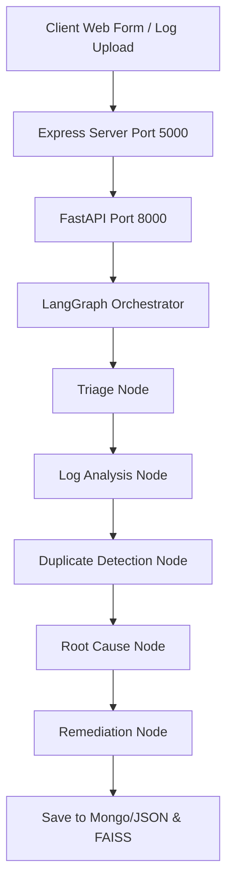

# Technical Documentation - Milestone 4

## 1. Project Overview
The **AI Smart Bug Analyzer & Fix Advisor (BugSense AI)** is an enterprise-ready, full-stack RAG (Retrieval-Augmented Generation) application designed to automate triage, diagnostic analysis, and fix recommendations for software bugs. By matching raw log outputs and descriptions against a FAISS vector store of historical fixes, it produces rapid, high-confidence engineering solutions.

## 2. System Architecture & Workflows
The multi-agent diagnostics system runs sequentially inside LangGraph:



## 3. Database Schema

### Bug Document Schema
```json
{
  "bugId": "BUG-1001",
  "title": "String",
  "description": "String",
  "severity": "String (Critical/High/Medium/Low)",
  "priority": "String (P1/P2/P3/P4)",
  "environment": "String",
  "module": "String",
  "reporterName": "String",
  "stackTrace": "String",
  "errorLog": "String",
  "createdAt": "Date"
}
```

### Knowledge Base Entry Schema
```json
{
  "bugId": "BUG-1001",
  "title": "String",
  "description": "String",
  "rootCause": "String",
  "fixAction": "String",
  "severity": "String",
  "priority": "String",
  "category": "String",
  "component": "String",
  "verified": "Boolean",
  "resolutionDate": "Date"
}
```

## 4. REST APIs

### Analytics
* **`GET /api/analytics/defect-patterns`**: Compiles metrics, severities, priority ratios, and exception counts.
* **`GET /api/analytics/export-csv`**: Downloads defect patterns and historical bug logs as a CSV file.

### Knowledge Base Growth
* **`POST /api/knowledge/add`**: Triggers semantic similarity comparison (threshold of 90%) to update existing knowledge or index new entries.
* **`POST /api/knowledge/verify`**: Sets verified check status.
* **`GET /api/knowledge/history`**: Lists resolution playbooks.
* **`GET /api/knowledge/stats`**: Summarizes verified records.
